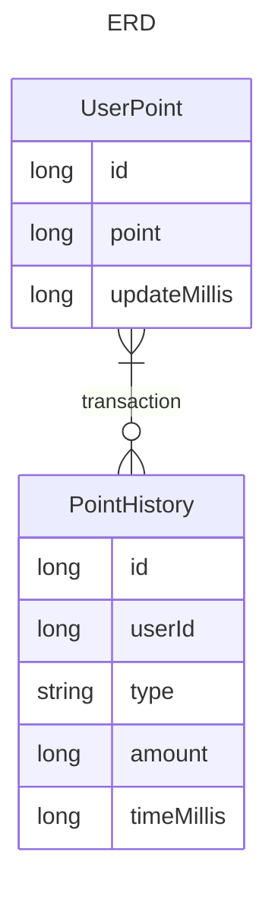

# 1주차 과제

## 요구사항

* 포인트를 충전할 수 있다
* 포인트를 사용할 수 있다
* 포인트를 조회할 수 있다
* 포인트 내역을 조회할 수 있다
* 잔고가 부족할 경우, 포인트를 사용할 수 없다
* 동시에 여러 건의 포인트 충전, 이용 요청이 들어올 경우 순차적으로 처리되여야 한다.

## ERD

* UserPoint: 사용자와 그 사용자가 가지고 있는 포인트를 나타낸다.
* PointHistory: 포인트의 증감내역을 나타낸다.
* TransactionType: 충전 혹은 사용을 나타내느 열거형이다.

### UserPoint 와 PointHistory 의 관계
* 포인트르 충전 혹은 사용했을 때, 이 증감 내용을 PointHistory 로 저장하고, 포인트의 변화된 결과를 UserPoint 에 반영한다.
* PointHistory 의 amount 가 포인트 변화량(절댓값)이고 TransactionType 으로 충전인지 사용인지를 저장한다.
* UserPoint 와 PointHistory 는 1대다 관계이다.
